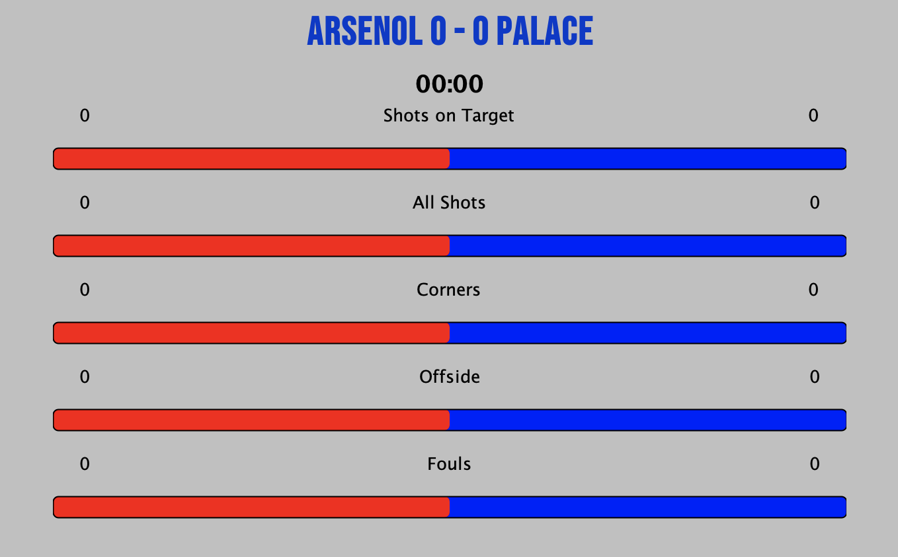
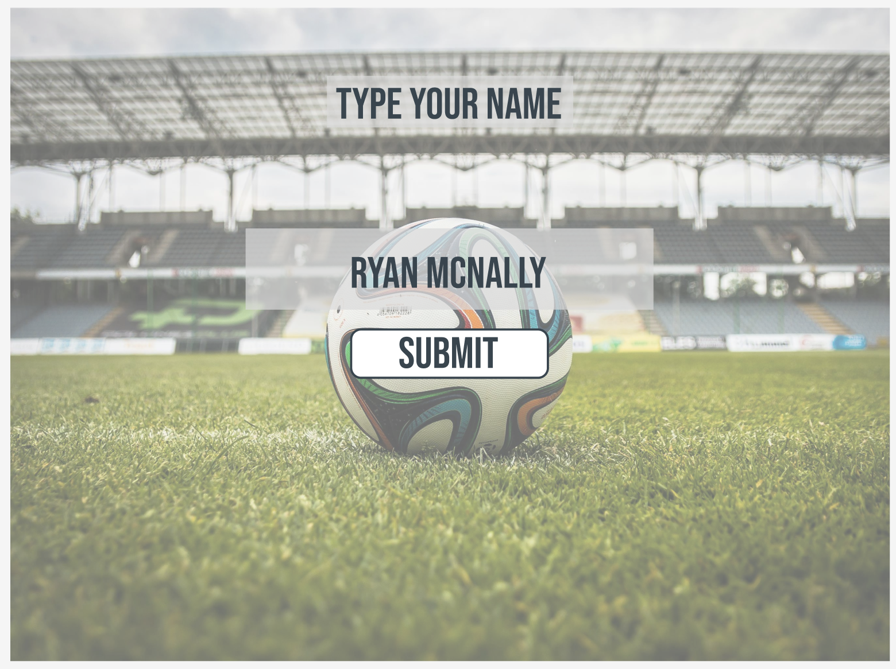
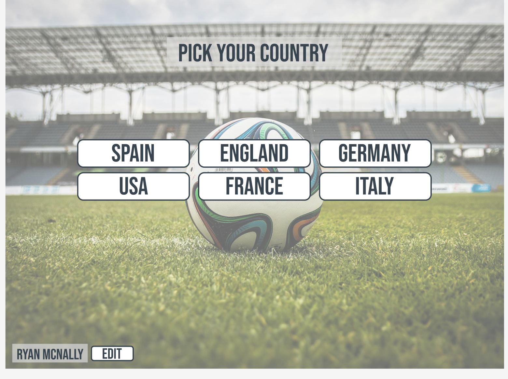
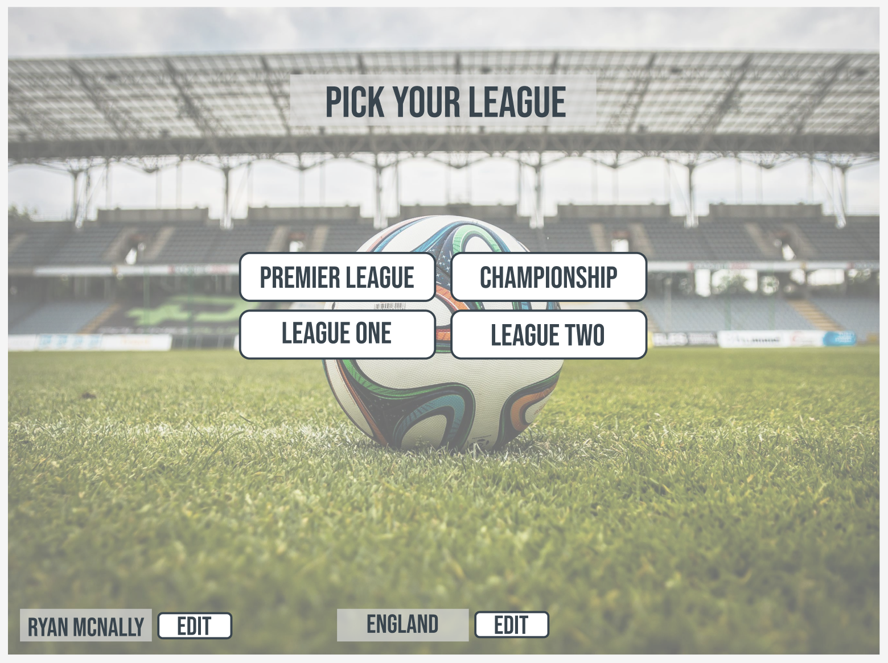
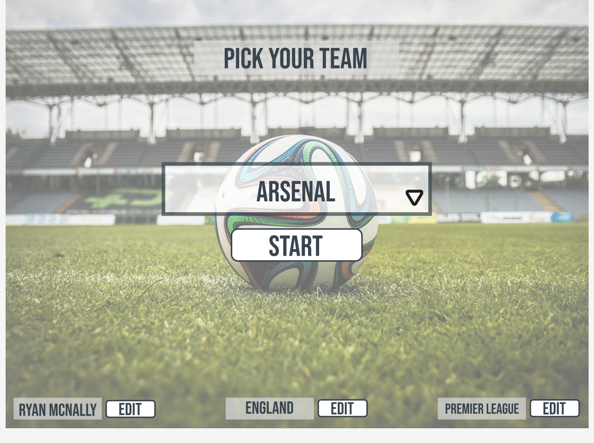
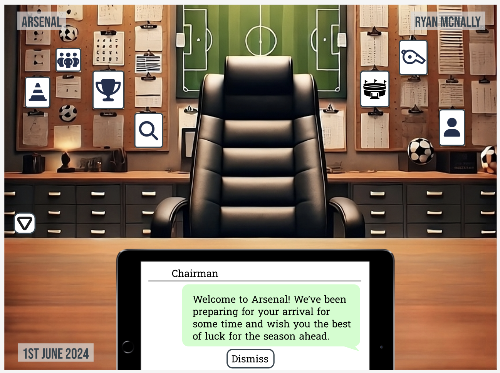
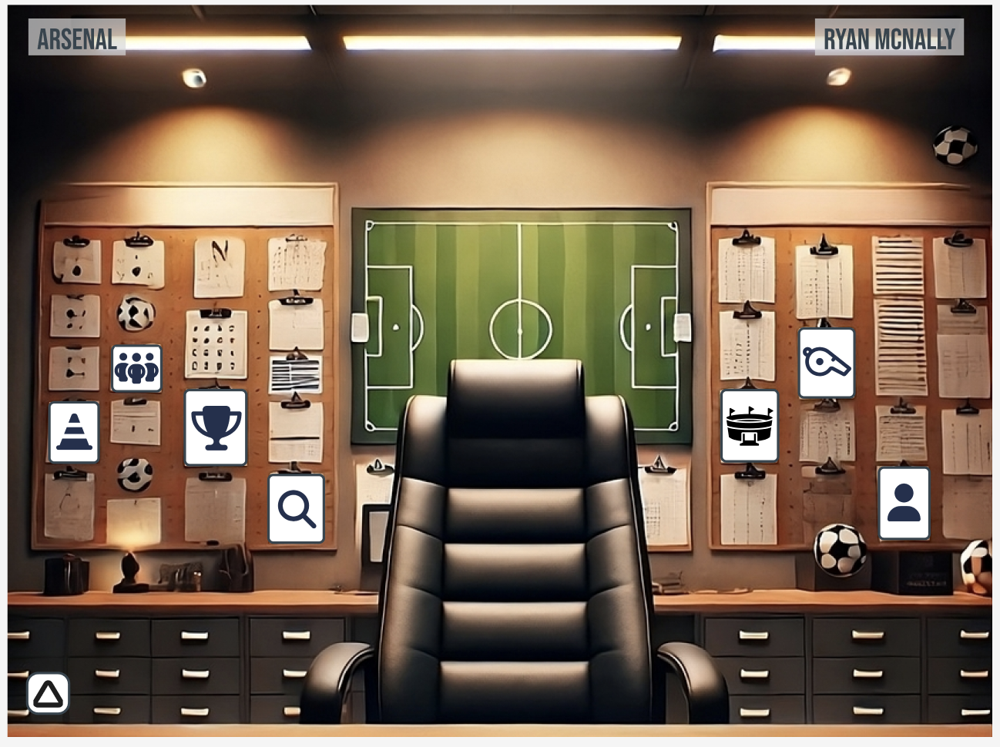

# Football Management Game

[//]: # ()

This is a personal project I started working on whilst an Academy student in Version 1 Birmingham. Inspired by various other football management games with a number of original ideas for a better experience.

This is a non-profit, just for fun game.

 

## Contents

- [UX](#ux)
    * [User Stories](#user-stories)
    * [Design Choices](#design-choices)
    * [Wireframes - Prototypes](#wireframes---prototypes)
    * [Java Swing](#java-swing)
    * [Cards & Navigation](#cards--navigation)
    * [Q & A of Consumers](#q--a-of-consumers)
    * [Roadmap](#roadmap)
    * [Existing Features](#existing-features)
    * [Features Left to Implement](#features-left-to-implement)
- [Testing](#testing)
    * [Fixed Bugs](#fixed-bugs)
    * [Unfixed Bugs](#unfixed-bugs)
    * [Responsive Design](#responsive-design)
- [Credits](#credits)
    * [Code](#code)
    * [Tools Used](#tools-used)
    * [Media](#media)
    * [Acknowledgements](#acknowledgements)

## UX
### User Stories

#### Managers wanting to start small

- Need to be able to improve the teams form in order to win prizes that can lead to better players.
- Need to be able to improve players individually as money will not be easy to come by.
- Need bigger job offers when form is going well.
- Should be tricky to get results against bigger teams.

#### Managers wanting to start big

- Will have more options at their tips in terms of players/facilities & staff quality.
- But this comes with a higher expectation of performance, poor form can lead to being fired.
- Should be able to sign better players easier.
- Should have more power but have a lot of responsibility with sometimes overwhelming options.

#### All managers

- Should have full control of their club, from its players and tactics, to its stadium builds, staffing and training.
- Should be able to move around the various pages easily, with buttons that clearly indicate where the user will travel to.
- Should be given tips by the coach's on which players to put where and how to get the most out of their team.
- Should see a fair result in matches considering the options they've made, this will be difficult and require a lot of thought and logic around the players decision making.

### Design Choices

The game will use colours specific to the teams currently selected or playing, along with original football imagery. The navigation will be possible through keystrokes and mouse clicks for ease of use.

#### Fonts

- I chose the all-caps Bebas Neue Regular font for titles as it is popular amongst football games as is strong and eye-catching.

#### Icons

- For player lines on the ratings page, this is the image used to illustrate a goal. The opacity is updated with a number to represent multiple goals.

- For clickable button icons, I've opted for a transparent up arrow inside a circle. I'm also going to update the cursor where used to make it more obvious that is clickable.

#### Colours

- The colours I want to use, exclusive of the teams colours, will be professional greys and dark blues.
- Team colours will be used on progress bars and kit colours shown for players. When the primary colour of the home team matches the secondary colour of the opponent, the primary colour of the opponent is used instead.

#### Styling

- App 'scheduler' will have an office type feel, this could change dependant on level of football played or country.
- 'Match frames' should be tailored to the competition level, from grassroots football themes to Champions League feels to them.
- 'Tactics frames' should have changing room themes.

#### Backgrounds & Images

- None used yet.

[//]: # ()

### Wireframes - Prototypes

- Admittedly, when first creting this game I was going off ideas from other football management games I'd played as a child. I wasn't following a set of ideas, but more just thinking, what would be a cool feature to have and where is best for it to live?

  - This did cause me to have to sit back at times and re-think big ideas. For example, my matches layout was going to be a few pages, one which had my fixtures, one which has all fixtures, and so on. When creating however, as I was creating these pages I decided a better approach would be to use one page for fixtures/results, and add filters to alter the page as required. This is an idea I decided to use on player achievements too.

- Once my original excitement to produce the next best feature calmed a little, I decided to look at what I have and what I wanted next. I create some great wireframes for each page of my game using [Figma](https://www.figma.com/).

#### Start Page

#### Scheduler

### Java Swing

- Having never used Java for front end before, this was my first experience using Java Swing. A lot of the issues I faced in the bugs section reflect the issues I faced and how I overcame them.
- I used customized JPanels on top of one-another for different levels of control.

[//]: # ()

- I used JLabels for headers and names/scores, including customized JLabel's with a circle round the letter for the 'C' captain label. I also used both normal and customized JButtons with mouse and key listeners for navigation.

[//]: # ()

- One issue I didn't resolve was the resizing of the window and its elements. This was extremely difficult as when I wanted to restrict the height of the window, it altered the width, and vice versa. I struggled even when using online AI tools such as ChatGPT.
  - I decided to keep the window one size throughout, leaving the door open for responsive design in the future should I decide this game will be played on multiple devices. 

#### Cards & Navigation

- I learned using CardLayout with JPanels was a great way of switching through pages and keeping or moving content across too.

### Q & A of Consumers

I've asked the following questions to:

- Person 1
- Person 2
- Person 3

[//]: # (#### Q1 - What are your favourite features of a football management game?)

[//]: # ()
[//]: # (Person 1:)

[//]: # ()
[//]: # (- "")

[//]: # ()
[//]: # (Person 2:)

[//]: # ()
[//]: # (- "")

[//]: # ()
[//]: # (Person 3:)

[//]: # ()
[//]: # (- "")

[//]: # ()
[//]: # (#### Q2 - Did you manage to find everything you wanted easily? If not, what couldn't you find?)

[//]: # ()
[//]: # (Person 1:)

[//]: # ()
[//]: # (- "")

[//]: # ()
[//]: # (Person 2:)

[//]: # ()
[//]: # (- "")

[//]: # ()
[//]: # (Person 3:)

[//]: # ()
[//]: # (- "")

[//]: # ()
[//]: # (#### Q3 - Were there any features you wanted, not included?)

[//]: # ()
[//]: # (Person 1:)

[//]: # ()
[//]: # (- "")

[//]: # ()
[//]: # (Person 2:)

[//]: # ()
[//]: # (- "")

[//]: # ()
[//]: # (Person 3:)

[//]: # ()
[//]: # (- "")

[//]: # ()
[//]: # (#### Q4 - Would you use this recommend this game to a friend? If not, why?)

[//]: # ()
[//]: # (Person 1:)

[//]: # ()
[//]: # (- "")

[//]: # ()
[//]: # (Person 2:)

[//]: # ()
[//]: # (- "")

[//]: # ()
[//]: # (Person 3:)

[//]: # ()
[//]: # (- "")

[//]: # ()
[//]: # (#### Q5 - How could this game be improved?)

[//]: # ()
[//]: # (Person 1:)

[//]: # ()
[//]: # (- "")

[//]: # ()
[//]: # (Person 2:)

[//]: # ()
[//]: # (- "")

[//]: # ()
[//]: # (Person 3:)

[//]: # ()
[//]: # (- "")

[//]: # (- )

[//]: # (#### Q6 - How did you find the match results/events? Were they fair based on players playing?)

[//]: # ()
[//]: # (Person 1:)

[//]: # ()
[//]: # (- "")

[//]: # ()
[//]: # (Person 2:)

[//]: # ()
[//]: # (- "")

[//]: # ()
[//]: # (Person 3:)

[//]: # ()
[//]: # (- "")

### Roadmap

This roadmap indicates the importance and viability of specific opportunities.

| Opportunities/Problems                          | Importance | Viability |
|-------------------------------------------------|------------|-----------|
| Feature 1                                       | 5          | 5         |
| Feature 2                                       | 1          | 1         |

## Features

### Existing Features

#### Start Page

- Add explanation of pages features

[//]: # ()

#### Scheduler & Events

- Add explanation of pages features

[//]: # ()

#### Match Pages

- Add explanation of pages features

[//]: # ()

### Features Left to Implement

#### Main Menu

- Add explanation of pages features

[//]: # ()

#### Transfer Pages

- Add explanation of pages features

[//]: # ()

#### Competition Pages

- Add explanation of pages features

[//]: # ()

#### Tactics Pages

- Add explanation of pages features

[//]: # ()

## Testing

You can view all testing in [this document.](https://github.com/ryanmcnally93/footballProject/blob/main/testing.md)

### Fixed Bugs

1. I struggled with splitting the screen in half on the 'MatchScorers' page, the preferredsize wasn't working.

>I managed to find a fix and it has worked for future implementations. If setting preferredsize alone doesn't work, setting it alongside setMinimumSize and setMaximumSize does work.

2. The next big issue I came across was the sliding panel, which enters the frame when a goal is scored, and lowers after a few seconds.
The frame was acting as required, but the 'z-index' was behind other components, and it needed to appear on top of everything else.
ChatGPT recommended using JLayeredPane, but attempting to implement it was messing things up furthur, as I needed to make every other element a 'DEFAULT_LAYER' item, so I had to re-arrange all of my elements within the Match Frames cardMap.

>In the end I realized I had to add it to the contentPane and add things to that. The sliding panel was then passed to a stronger 'layer', and this worked.

3. Another issue I had was when I updated the play button in match frames to a continue button, I needed it to take the user back to the scheduler.
This meant updating the mouse and keystroke event listeners. 

>I fixed this by removing the button from the parent element, along with the next button that was before it, and adding a new button 'continue' and putting the next button back.
I initially tried to update the actionMap but this proved a more difficult to fix to removing and adding the buttons was the cleaner fix.

4. The goal slider started slowing down during gameplay. The whole match wasn't flowing as nicely graphically.

> The issue turned out to be caused by nemesislookandfeel, which I added to make customize my buttons easier. I intend to use it on individual elements in the future but for now this isn't needed.

5. On a few occasions, Match Week 12 would be created but week 13 couldn't be created due to conflictions with the 8 matches left.
My first attempt of a fix was to remove game week 12 and return the fixtures from that week to the available fixtures, and re-create the last 3 weeks, to give the method a better chance of completing.
This worked on occasion, but also failed from time to time.

>In the end I decided to make the whole process restart if we hit this endless loop, removing the original matchweeks and restarting the process. Excessive use of print logs massively helped with breaking down the process logic and the fix works 100% of the time now.

6. The first time I managed to get a whole season of matches playing, I noticed after the first match I lost every other match spectacularly, until I reached a team I had already played, and then it was a 0-0 draw.

>This turned out to be because the players stamina was reaching 0 in the first game, and never being reset! As a temporary measure, I have made a method that sets the stamina of all players back to 100 at the end of a match.

### Unfixed Bugs

1. Update Wireframes, Roadmap, Features, Swing usage, Q&A, Responsive Design attempts, Credits
2. Update Bugs 
3. Write tests 
4. Use the wireframes to continue to create the game, using BDD and TDD.

### Responsive Design

#### East & West boxes

- Add explanation of responsive design.

[//]: # ()

#### Inner Content

- Add explanation of responsive design.

#### Setting Width & Height restrictions for the app

- Add explanation of responsive design.

## Credits

### Code

- Explanation of code borrowed or outsourced.

### Tools Used

- Explanation of tools used.

### Media

#### Font

- BebasNeue-Regular.ttf

#### Images

- Football image on Ratings page
- Player View Icon

### Acknowledgements

- Thank you to Chester Gardner of WeAreTechGlobal for inspiring this project start with an assignment in my academy.

This readme.md will be spellchecked using the spell checker extension for Chrome.

All documents within this repository will be formatted using "Prettier".
